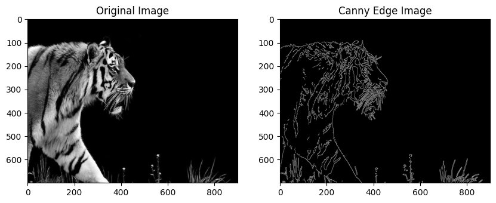

# Canny Edge Detection

## Aim
To perform edge detection on a given image using the Canny Edge Detection algorithm in OpenCV.

## Software Required
- Python 3.x  
- OpenCV (`cv2` module)  
- NumPy  
- Matplotlib  

## Algorithm (5 Steps)
1. **Read and Convert Image:** Load the image and convert it to grayscale for processing.  
2. **Noise Reduction:** Apply Gaussian Blur to smooth the image and reduce noise.  
3. **Compute Gradients:** Detect intensity gradients using Sobel filters internally.  
4. **Non-Max Suppression:** Thin the detected edges to preserve sharp boundaries.  
5. **Thresholding and Hysteresis:** Apply double threshold to identify and connect strong edges.

## Python Code
```python

import cv2
import matplotlib.pyplot as plt
import numpy as np


img = cv2.imread('input.jpg',0)


plt.imshow(img,cmap='gray');plt.title("Original Gray Image");plt.show()


blur = cv2.blur(img, ksize=(3,3))
plt.imshow(blur,cmap='gray');plt.title("Blurred Image");plt.show()


medium = np.median(img)


low=int(max(130,0.7+medium))
high=int(max(230,1/3+medium))
print(f"{low},{high}")


canny_edge_blur = cv2.Canny(blur, low, high)


plt.figure(figsize=(10,5))
plt.subplot(1,2,1);plt.imshow(cv2.resize(img,(900,700)),cmap='gray');plt.title("Original Image")
plt.subplot(1,2,2);plt.imshow(cv2.resize(canny_edge_blur,(900,700)),cmap='gray');plt.title("Canny Edge Image")
plt.show()

```
## OUTPUT



## Result
The Canny Edge Detection algorithm successfully detects and highlights the edges of objects in the input image, providing a clear edge map of the scene.
